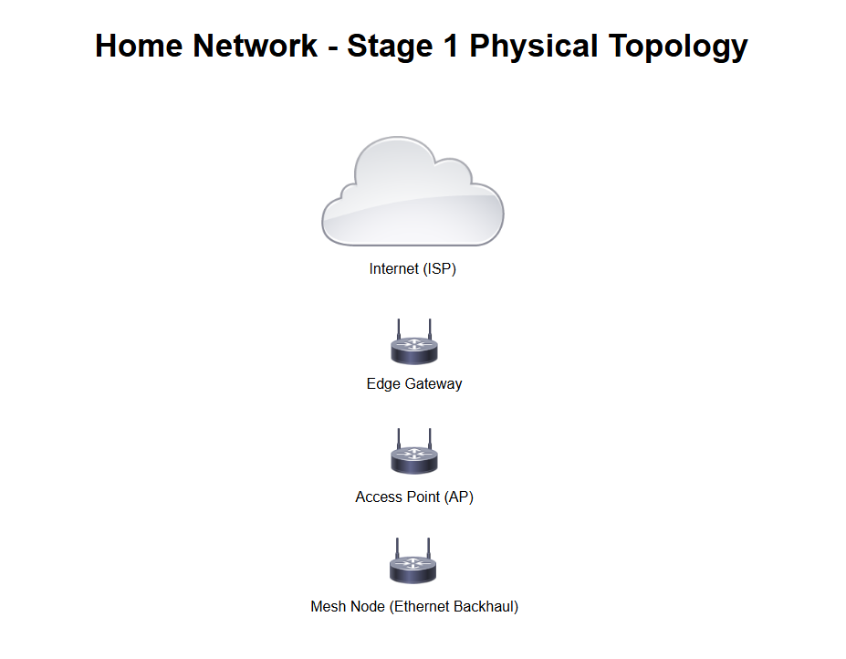
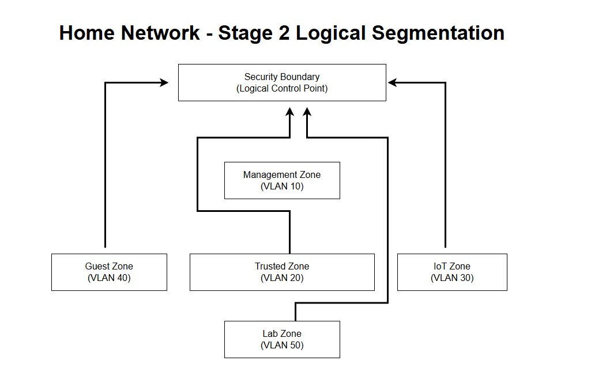

# Home Network Design

This repository documents the design of a segmented home network, focusing on
clear separation between physical topology and logical security zones.

The project is intentionally vendor-neutral and avoids exposing IP addresses,
SSIDs, or hardware models.

---

## Stage 1 — Physical Topology

High-level view of the physical layout of the network, showing device roles and
connectivity only.

---

## Stage 2 — Logical Segmentation

Logical security zones and VLAN separation, illustrating trust boundaries and
conceptual traffic flow.

---

## Notes

- This repository documents **design only**, not live configuration
- VLAN IDs are illustrative and may change in future implementation stages
- Firewall enforcement and policy rules will be introduced in later phases
